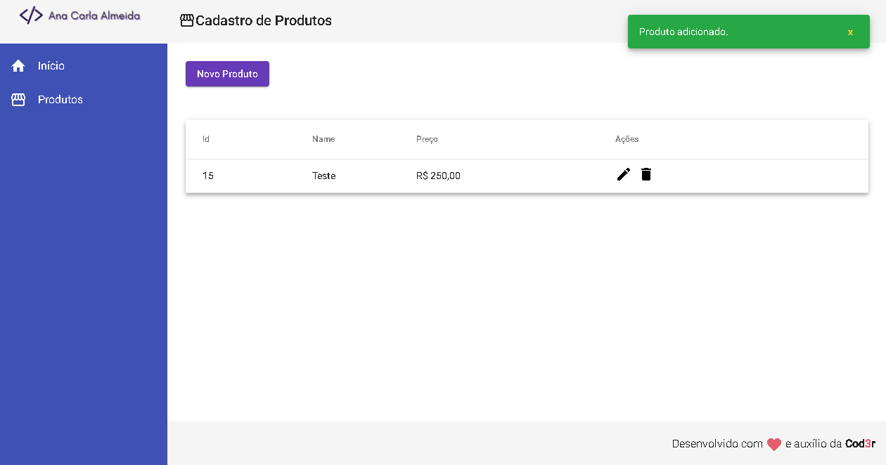

## Simple CRUD Products - Angular

#### Para conferir o resultado acesse o link abaixo:
https://simple-products-crud-angular.netlify.app

Aplicação sem necessidade de autenticação, concluída no intuito de estudar Angular. 
Trata-se de um simples CRUD de produtos. 
Foi utilizado de parâmetro a aula da Cod3r de Angular 9.

O Back-end foi construído com Node.js, ele se encontra na branch "back-end" e seu deploy pela heroku no link abaixo:  
https://simple-crud-products.herokuapp.com

Obs.: Assim que incluir os produtos, por favor removê-los ;) 
Aplicação apenas para teste, fique a vontade!

